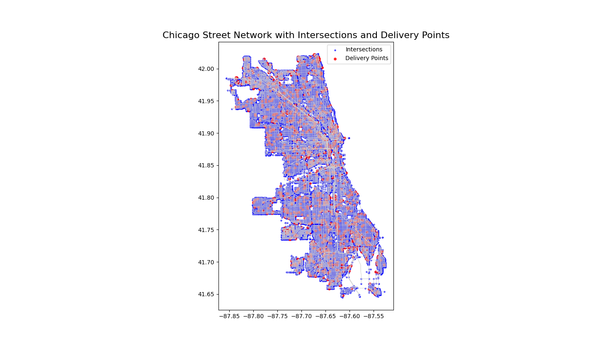

## Introduction:

With the rapid growth of e-commerce and urban delivery services, efficiently planning delivery routes in large cities has become a critical problem. The goal of this project is to optimize delivery routes for a set of random delivery points across Chicago’s street network. The problem is analogous to the Traveling Salesman Problem (TSP), where a delivery vehicle must visit multiple locations while minimizing total travel distance or time. Efficient routing not only saves operational costs but also reduces fuel consumption and traffic congestion.

---

Figure 1: Chicago Street Network with delivery points. Road segments (edges) are shown in light gray, intersections (nodes) are shown in blue, and delivery points are highlighted in red. The x-axis represents the longitude of each location in Chicago, while the y-axis represents the latitude, providing a spatial reference for the city’s road network and delivery locations.

